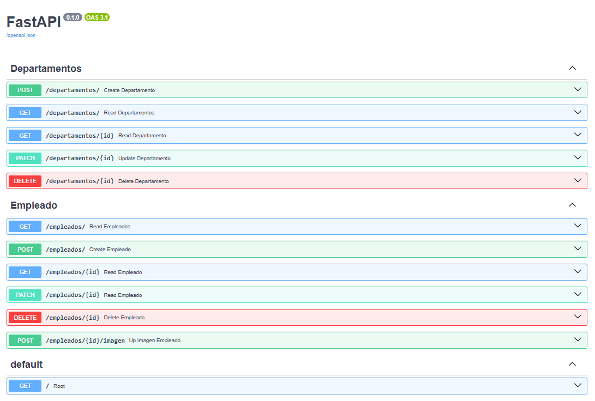

# EmpleadosAPI
Esta es una API de caracter educativo.

El código que aquí encontarás representa una práctica sencilla para crear una API básica y poder comprender el desarrollo en capas de la misma y cómo se implementan las rutas de los CRUD necesarios para las peticiones.

> Despliegue en local.

## Autor

JvCorMo


## Colaboraciones 

Gurú - Profesor Javier Palacios DAM Luis Vives.

## API de FastAPI con SQLModel
Esta API utiliza FastAPI, un framework moderno y rápido para construir APIs en Python, y SQLModel, una librería que combina lo mejor de SQLAlchemy y Pydantic para definir modelos de datos y manejar bases de datos de forma sencilla.

La combinación permite crear rutas, validaciones y consultas a la base de datos de manera estructurada y segura, ideal para proyectos educativos y prototipos rápidos entre otras.

Ejemplo de uso: gestionar Empleados y Departamentos con una base de datos SQLite.

 

## Construir la imagen de Docker

Antes de construir la imagen, asegúrate de que _Docker Desktop_ esté arrancado.

Desde el directorio raíz del proyecto ( donde se encuentra el archivo _Dockerfile_ ), ejecuta :
```bash
docker build -t nombreX_api .
```
- Donde nombreX es el nombre que quieras asignar.

> Si el requirements.txt y el código están dentro de app/, el Dockerfile debería copiarlo correctamente mediante :

```
COPY app/requirements.txt ./requirements.txt
```


## Ejecutar el contenedor Docker
Con SQLite, puedes ejecutar:
```bash
docker run -d -p 8080:8080 nombreX_api
```
### > Tras ejecutar...

Tras lanzar el contenedor debería de mostrarse en la terminal la ejecución de creación de las tablas de la base de datos correspondiente al proyecto.

## Persistencia. 
La API puede guardar imagenes para empleados.
Si se elimina el contenedor o es reproducido, estas se perderán.
### Lograr la persistencia para imagenes.
- El Dockerfile actual las imágenes se guardan mientras el contenedor exista.
- Para persistencia, agregar dentro del _Dockerfile_ :
```
VOLUME /code/app/media
```
- Esto crea un volumen anónimo dentro del host.
- O bien, puedes crear un volumen explícito:
```
docker volume create empleados_media
docker run -p 8000:8000 --env-file .env -v empleados_media:/code/app/media nombreX_api
```
# Problemas comunes y soluciones.
<details><summary>Click para ver los problemas al lanzar el contenedor</summary>

> Error ModuleNotFoundError: No module named 'fastapi'.
- Solución: asegúrate de que requirements.txt esté correctamente ubicado y reconstruye la imagen usando --no-cache:
```
docker build --no-cache -t nombreX_api .
```
---  
<br>

> Archivo .env no encontrado
- Solución: verifica que el .env esté en la ruta correcta o pásalo al contenedor con --env-file:
```
docker run --env-file app/.env -p 8080:8080 nombreX_api
```
---
<br>

> Persistencia de archivos (imágenes)
Puedes realizar este paso para montar un volumen
- Solución: utiliza volúmenes de Docker para que los archivos no se pierdan al eliminar contenedores:
```
docker volume create empleados_media
docker run -p 8080:8080 --env-file app/.env -v empleados_media:/code/app/media nombreX_api
```
</details>

---
<br>

# Usar los CRUD desde FastAPI Docs
FastAPI genera automáticamente una interfaz web interactiva para tu API usando Swagger UI. Ahí puedes probar todos los endpoints sin necesidad de CURL ni Postman.

## Abrir la documentación
* Abre el navegador y entra en:
```
http://localhost:8080/docs
```
- Verás una lista de todos los endpoints como en la imágen de arriba.

## Explorar un endpoint
Haz clic sobre el endpoint que quieras probar ( por ejemplo, GET /empleados ).

Se despliega un panel con :
- Code: descripción del endpoint.
- Parameters: campos requeridos o query parameters.
- Try it out: botón para activar la edición de campos.

## Realizar operaciones CRUD
### > Crear ( POST )
- Selecciona POST /empleados
- Haz clic en Try it out
- Rellena el JSON de ejemplo con los datos del empleado.
- Haz clic en Execute.
- Verás la respuesta con el empleado creado y el código HTTP 200 o 201. Si todo salio correctamente.

### > Leer ( GET )
- Selecciona GET /empleadoss para listar todos los empleados
- Haz clic en Try it out → Execute
- Se mostrará la lista de empleados en la sección Responses.
> Para leer un empleado específico, usa GET /employees/{id} y escribe el ID del empleado.

### > Actualizar (PUT)
- Selecciona PUT /empleadoss/{id}
- Haz clic en Try it out.
- Rellena el ID del empleado y el JSON con los cambios.
- Haz clic en Execute.

La respuesta mostrará el empleado actualizado.

### > Eliminar (DELETE)
- Selecciona DELETE /empleados/{id}
- Haz clic en Try it out.
- Introduce el ID del empleado a eliminar.
- Haz clic en Execute.

La respuesta indicará si la eliminación fue exitosa (normalmente HTTP 200 o 204).

--- 
<br>

# Licencia
MIT

## Buenas prácticas y advertencia
Este repositorio tiene fines educativos y de práctica. Antes de usarlo, ten en cuenta lo siguiente:
- Revisa siempre el código antes de ejecutarlo en tu máquina o en producción.  
- La seguridad es tu responsabilidad: no se garantiza que el código esté libre de errores o vulnerabilidades.  
- Usa entornos aislados ( virtualenv, Docker, contenedores ) para ejecutar la aplicación.  
- Evita exponer datos sensibles, como contraseñas o archivos en `.env`.  
- Revisa su contenido.
- Aprende del código, experimenta y adapta según tus necesidades.
- No asumas que es seguro para producción.
- Protege tus datos y entorno.

---

<br>

> *Hay veces que quien menos te esperas hace cosas sorprendentes* — Alam Turyn
<br>

---